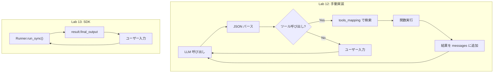

# Lab 13 Walkthrough: OpenAI Agents SDK への移行

この Walkthrough では、Lab 12 の**手動エージェント**を **OpenAI Agents SDK** に移行した内容を詳しく説明します。

---

## 変更されたファイル

### [screening_agent.py](file:///Users/nabetanir100/Documents/fde-lab/screening_agent.py)

> [!WARNING]
> ファイル名は `agents.py` ではなく `screening_agent.py` にしてください。
> SDK パッケージ名 `agents` と衝突し、インポートエラーになります。

---

## 主な変更点

### 1. インポートの変更

**削除:**

```python
import json
from langchain_openai import ChatOpenAI
from langchain.prompts import ChatPromptTemplate
```

**追加:**

```python
from agents import Agent, Runner, function_tool, set_default_openai_key, SQLiteSession
```

> [!NOTE]
> LangChain は不要になりました。OpenAI Agents SDK が LLM 呼び出しとツール実行を一括で管理します。

---

### 2. `@function_tool` デコレータ

```diff
+@function_tool
 def extract_skills(session_id: str, job_id: int) -> list[str]:
     """Given a job_id, lookup job description..."""
     ...
```

**デコレータとは？** 関数の「上に書く特殊な記法」です。Python が関数を読み込む時に、デコレータが関数を「変換」します。

```python
# これと同じ意味
def extract_skills(...):
    ...
extract_skills = function_tool(extract_skills)  # ← SDKに登録
```

**何が起こるか:**

1. SDK が関数名（`extract_skills`）を取得
2. 引数の型情報（`session_id: str, job_id: int`）を解析
3. docstring を説明文として使用
4. ツールスキーマを自動生成 → LLM に渡す

---

### 3. プロンプトの簡素化

render_diffs(file:///Users/nabetanir100/Documents/fde-lab/agents.py)

**削除されたセクション:**

| セクション        | 行数   | 理由                          |
| ----------------- | ------ | ----------------------------- |
| `# OUTPUT FORMAT` | ~25 行 | SDK がフォーマットを管理      |
| `# TOOLS`         | ~15 行 | `@function_tool` から自動生成 |

Lab 12 では「JSON で出力して」と LLM に指示していましたが、SDK は OpenAI の **ネイティブ Function Calling** を使用するため不要です。

---

### 4. `tools_mapping` の削除

**Lab 12:**

```python
tools_mapping = {
    "extract_skills": extract_skills,
    "update_evaluation": update_evaluation,
    "transfer_to_skill_evaluator": transfer_to_skill_evaluator
}
```

**Lab 13:**
削除！`Agent()` に直接関数を渡すだけ:

```python
agent = Agent(
    ...
    tools=[extract_skills, transfer_to_skill_evaluator, update_evaluation]
)
```

---

### 5. エージェントループの大幅簡素化

**Lab 12 (手動) - 約 50 行:**

````python
while user_reply.lower() != "bye":
    output = orchestrator_chain.invoke(...)

    # JSON パース
    content = output.content
    if content.startswith("```"):
        lines = content.split("\n")
        content = "\n".join(lines[1:-1])
    data = json.loads(content)

    # ツール呼び出し判定
    if "tool_name" in data and data["tool_name"] != "":
        tool_name = data["tool_name"]
        params = {param["param"]: param["value"] for param in data["tool_params"]}
        tool_function = tools_mapping[tool_name]
        tool_output = tool_function(**params)
        messages.append(...)
    else:
        user_reply = input("User: ")
        messages.append(...)
````

**Lab 13 (SDK) - 約 10 行:**

```python
while user_input.lower() != "bye":
    result = Runner.run_sync(agent, user_input, session=session)
    print(f"\nAgent: {result.final_output}\n")
    user_input = input("User: ")
```

> [!IMPORTANT] > `Runner.run_sync()` の内部で、Lab 12 の全ロジック（JSON パース → ツール判定 → 実行 → 結果追加）が**自動実行**されます。

---

## SDK コンポーネント解説

### `Agent` クラス

```python
agent = Agent(
    name="Interview Orchestrator Agent",  # デバッグ用の名前
    instructions=ORCHESTRATOR_SYSTEM_PROMPT,  # システムプロンプト
    model="gpt-4.1",  # 使用モデル
    tools=[extract_skills, ...]  # 使用可能なツール
)
```

エージェントの**設定**を保持するオブジェクト。実行はしません。

---

### `Runner.run_sync()`

```python
result = Runner.run_sync(agent, user_input, session=session)
```

エージェントを**実行**します。内部で:

1. LLM に入力を送信
2. レスポンスを解析
3. ツール呼び出しがあれば実行
4. 結果を LLM に返す
5. 最終回答が得られるまで繰り返す

---

### `SQLiteSession`

```python
session = SQLiteSession(f"screening-{session_id}")
```

会話履歴を SQLite に保存します。次回起動時も履歴を引き継げます。

---

## フロー比較



---

## 実行方法

```bash
source venv/bin/activate
python screening_agent.py
```

---

## トラブルシューティング

### エラー: `cannot import name 'Agent' from 'agents'`

**原因:** ファイル名が `agents.py` になっている
**解決:** ファイル名を `screening_agent.py` に変更

```bash
mv agents.py screening_agent.py
```

---

### エラー: `TypeError: Unable to evaluate type annotation 'float | None'`

**原因:** Python 3.9 では `float | None` の新しい型構文がサポートされていない
**解決:** バックポートパッケージをインストール

```bash
pip install eval_type_backport
```

または、Python 3.10 以上で venv を再作成:

```bash
rm -rf venv
python3.12 -m venv venv
source venv/bin/activate
pip install -r requirements.txt
```

---

### エラー: `No module named 'agents.extensions.persistence'`

**原因:** Lab13.md の hints と実際の SDK のモジュール構造が異なる
**解決:** `SQLiteSession` は `agents` モジュールから直接インポート

```python
# ❌ 間違い
from agents.extensions.persistence import SQLiteSession

# ✅ 正しい
from agents import Agent, Runner, function_tool, set_default_openai_key, SQLiteSession
```

---

## まとめ

| 項目        | Lab 12            | Lab 13        |
| ----------- | ----------------- | ------------- |
| 行数        | ~250 行           | ~150 行       |
| JSON パース | 手動              | 自動          |
| ツール実行  | 手動              | 自動          |
| 履歴管理    | 手動              | SQLiteSession |
| プロンプト  | JSON + ツール定義 | 指示のみ      |

> [!TIP]
> SDK を使うことで、**ビジネスロジック（ツール関数）に集中**できます。インフラ部分は SDK にお任せ！
