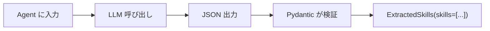
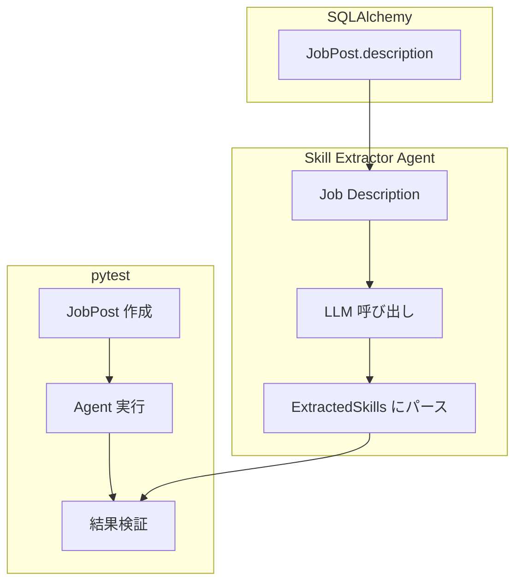

# Lab 14 Walkthrough: Extract Skills (実 DB + Agents SDK)

この Walkthrough では、ハードコードされたスキル抽出を**実際の DB + AI エージェント**に置き換えた実装を詳しく説明します。

---

## 変更されたファイル

| ファイル                                                                                                | 変更内容             |
| ------------------------------------------------------------------------------------------------------- | -------------------- |
| [screening_agent.py](file:///Users/nabetanir100/Documents/fde-lab/screening_agent.py)                   | 実 DB からスキル抽出 |
| [test/test_extract_skills.py](file:///Users/nabetanir100/Documents/fde-lab/test/test_extract_skills.py) | pytest 追加          |

---

## 主な変更点

### 1. 実 DB への接続

**新しいヘルパー関数:**

```python
from sqlalchemy import create_engine
from sqlalchemy.orm import sessionmaker
from models import JobPost

def get_db_session():
    """SQLAlchemy セッションを取得"""
    engine = create_engine(str(settings.DATABASE_URL))
    Session = sessionmaker(bind=engine)
    return Session()
```

**なぜ新しい関数？**

| 既存の `get_db()`          | 新しい `get_db_session()`   |
| -------------------------- | --------------------------- |
| ジェネレータ (FastAPI 用)  | 通常の関数                  |
| `yield` でセッションを返す | `return` でセッションを返す |
| 依存性注入向け             | ツール内で同期的に使用      |

---

### 2. Pydantic `output_type` とは？

```python
from pydantic import BaseModel, Field

class ExtractedSkills(BaseModel):
    """AI の出力形式を定義"""
    skills: list[str] = Field(description="技術スキルのリスト")
```

**SDK での使い方:**

```python
skill_extractor_agent = Agent(
    name="Skill Extractor Agent",
    instructions="...",
    model="gpt-4.1",
    output_type=ExtractedSkills  # ← ここで指定
)
```

**内部で何が起こるか:**



> [!NOTE]
> SDK が自動的に Pydantic モデルを JSON スキーマに変換し、LLM に「この形式で出力して」と指示します。

---

### 3. `extract_skills` の変更

**Before (Lab 13):**

```python
@function_tool
def extract_skills(session_id: str, job_id: int) -> list[str]:
    job_description = db["job_descriptions"][job_id]  # ダミー辞書
    skills = ["Python", "SQL", "System Design"]  # ハードコード
    return skills
```

**After (Lab 14):**

```python
@function_tool
def extract_skills(session_id: str, job_id: int) -> list[str]:
    # 1. 実際の DB から JobPost を取得
    db_session = get_db_session()
    try:
        job_post = db_session.query(JobPost).filter(JobPost.id == job_id).first()
        job_description = job_post.description
    finally:
        db_session.close()

    # 2. Skill Extractor Agent を実行
    result = Runner.run_sync(
        skill_extractor_agent,
        f"Extract skills:\n\n{job_description}"
    )

    # 3. 結果を取得 (ExtractedSkills 型)
    skills = result.final_output.skills
    return skills
```

---

## pytest の構造

### テストファイル: [test_extract_skills.py](file:///Users/nabetanir100/Documents/fde-lab/test/test_extract_skills.py)

```python
class TestExtractSkills:
    """メインのテストクラス"""

    @pytest.fixture(autouse=True)
    def setup_openai(self):
        """各テスト前に OpenAI API キーをセット"""
        set_default_openai_key(settings.OPENAI_API_KEY)
```

> [!TIP] > **`@pytest.fixture(autouse=True)`** は、すべてのテストで自動的に実行されるセットアップを定義します。

---

### テストケース解説

#### テスト 1: JobPost の作成

```python
def test_create_job_board_and_post(self, db_session):
    """DB に JobBoard と JobPost を作成"""
    job_board = JobBoard(slug="test-board", logo_url="...")
    db_session.add(job_board)
    db_session.flush()  # ID を取得（コミットはしない）

    job_post = JobPost(
        title="AI Engineer",
        description="Python, LangChain, SQL...",
        job_board_id=job_board.id
    )
    db_session.add(job_post)
    db_session.flush()

    assert job_post.id is not None
```

**`flush()` vs `commit()` の違い:**

| メソッド   | 動作                                          |
| ---------- | --------------------------------------------- |
| `flush()`  | DB に書き込むが、トランザクションは開いたまま |
| `commit()` | 変更を確定し、トランザクションを終了          |

テストでは `flush()` を使い、テスト終了時に自動ロールバック。

---

#### テスト 2: AI によるスキル抽出

```python
def test_extract_skills_from_job_post(self, db_session):
    """Job Description から AI でスキルを抽出"""
    # JobPost 作成
    job_post = JobPost(
        description="Python, FastAPI, Docker, AWS..."
    )

    # Agent 実行
    result = Runner.run_sync(
        skill_extractor_agent,
        f"Extract skills:\n\n{job_post.description}"
    )

    # 検証
    assert isinstance(result.final_output, ExtractedSkills)
    assert len(result.final_output.skills) > 0
```

---

#### テスト 3: output_type の型チェック

```python
def test_agent_output_type(self):
    """Agent が正しい型を返すことを確認"""
    result = Runner.run_sync(
        skill_extractor_agent,
        "Extract skills: Python, SQL, AWS"
    )

    assert isinstance(result.final_output, ExtractedSkills)
```

---

## テストの実行方法

```bash
source venv/bin/activate

# 全テスト実行
pytest test/test_extract_skills.py -v

# 特定のテストのみ
pytest test/test_extract_skills.py::TestSkillExtractorAgent::test_agent_output_type -v
```

### テスト結果例

```
test/test_extract_skills.py::TestSkillExtractorAgent::test_agent_output_type PASSED [100%]
======================== 1 passed in 2.19s =========================
```

---

## データフロー全体図



---

## まとめ

| 項目         | Lab 13       | Lab 14                   |
| ------------ | ------------ | ------------------------ |
| データソース | ダミー辞書   | **JobPost テーブル**     |
| スキル抽出   | ハードコード | **AI エージェント**      |
| 出力形式     | 固定リスト   | **Pydantic output_type** |
| テスト       | なし         | **pytest 追加**          |

> [!IMPORTANT] > **ポイント:** `output_type` を使うと、LLM の出力が Pydantic モデルで自動検証されます。型安全な AI アプリケーションの構築に重要！
