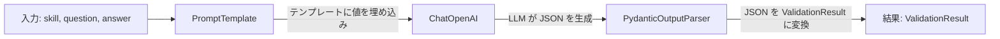
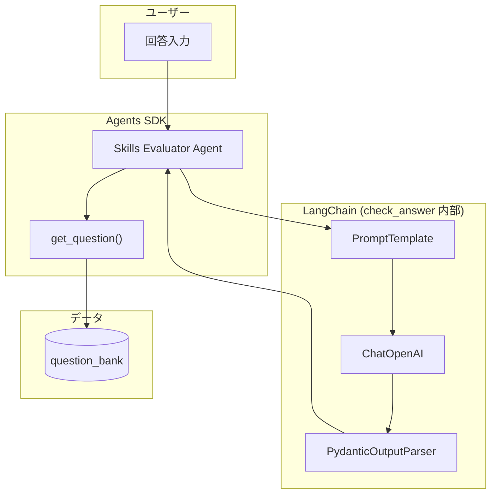

# Lab 15 Walkthrough: Multi Agent Systems - Skills Evaluator

この Walkthrough では、Lab 15 の各指示に対して**どのコードが回答になるか**を詳しく説明します。

---

## Lab 15 の目標

**Skills Evaluator Agent** を作成します。このエージェントは：

- 候補者に最大 3 問の質問をする
- 正解/不正解で難易度を調整する
- 最終的に合否を判定する

---

## Lab 指示 → 実装の対応表

| Lab 指示                         | 実装場所                      |
| -------------------------------- | ----------------------------- |
| 1. Question Bank を追加          | `screening_agent.py` L49-90   |
| 2. `get_question` を実装         | `screening_agent.py` L267-276 |
| 3. `check_answer` を実装         | `screening_agent.py` L279-294 |
| 4. テストケースで検証            | `test/test_extract_skills.py` |
| 5. `run_evaluation_agent` を実装 | `screening_agent.py` L329-345 |
| 6. `main()` を更新               | `screening_agent.py` L370-383 |

---

## Step 1: Question Bank を追加

### Lab の指示

> Add the question bank variable to the `agent.py` file

### 実装コード

```python
question_bank = {
    "python": {
        "easy": [
            "If `d` is a dictionary, then what does `d['name'] = 'Siddharta'` do?",
            "if `l1` is a list and `l2` is a list, then what is `l1 + l2`?",
        ],
        "medium": [
            "How do you remove a key from a dictionary?",
            "How do you reverse a list in python?"
        ],
        "hard": [
            "If `d` is a dictionary, then what does `d.get('name', 'unknown')` do?",
            "What is the name of the `@` operator (Example `a @ b`) in Python?"
        ]
    },
    "sql": {
        # 同様の構造
    },
    "system design": {
        # 同様の構造
    }
}
```

### 初心者向け解説

**辞書のネスト構造:**

```
question_bank
  └── "python"
        ├── "easy"    → ["質問1", "質問2"]
        ├── "medium"  → ["質問1", "質問2"]
        └── "hard"    → ["質問1", "質問2"]
  └── "sql"
        └── ...
```

**アクセス方法:**

```python
question_bank["python"]["medium"]
# → ["How do you remove a key...", "How do you reverse a list..."]
```

---

## Step 2: `get_question` ツールを実装

### Lab の指示

> Implement `get_question(topic: str, difficulty: Literal['easy', 'medium', 'hard']) -> str` tool
>
> - It should look up the questions from the question bank
> - Use `random.choice()` function from `random` module to randomly choose a question
> - Don't forget the decorator

### 実装コード

```python
import random
from typing import Literal

@function_tool  # ← デコレータを忘れずに！
def get_question(topic: str, difficulty: Literal['easy', 'medium', 'hard']) -> str:
    """Return a question from the question bank given a topic and the difficulty of the question"""
    try:
        questions = question_bank[topic.lower()][difficulty.lower()]
        question = random.choice(questions)
        print(f"📝 Question ({difficulty}): {question}")
        return question
    except KeyError:
        return f"No questions available for topic '{topic}' at difficulty '{difficulty}'"
```

### 初心者向け解説

**`@function_tool` デコレータとは？**

Agents SDK にこの関数を「ツール」として登録するためのマーカーです。

```python
@function_tool  # これがないと Agent がこの関数を使えない
def get_question(...):
```

**`Literal['easy', 'medium', 'hard']` とは？**

型ヒントの一種で、「この 3 つの値のみ許可」という意味です。

```python
# OK
get_question("python", "easy")
get_question("python", "medium")
get_question("python", "hard")

# NG (型チェッカーが警告)
get_question("python", "super_hard")
```

**`random.choice()` とは？**

リストからランダムに 1 つ選ぶ関数です。

```python
import random
random.choice(["A", "B", "C"])  # "A" or "B" or "C" をランダムに返す
```

**`topic.lower()` とは？**

文字列を小文字に変換します。これで大文字小文字を気にせず使えます。

```python
"PYTHON".lower()  # → "python"
"Python".lower()  # → "python"
```

---

## Step 3: `check_answer` ツールを実装

### Lab の指示

> Implement `check_answer(skill: str, question: str, answer: str) -> Tuple[bool, str]` tool
>
> - This tool will use an LLM prompt to evaluate the answer
> - Then create the `llm`, `parser`, `prompt` (We need to use `PromptTemplate` instead of `ChatPromptTemplate`. Why?) and finally the `chain`
> - Invoke the chain with the `skill`, `question` and `answer` as inputs
> - return `output.model_dump_json()`

### 実装コード

#### 3-1. ValidationResult モデル

```python
class ValidationResult(BaseModel):
    correct: bool
    reasoning: str
```

**これは何？**

LLM の出力を**構造化**するためのクラスです。
LLM は自由なテキストを返しますが、プログラムで扱いやすいよう `correct` と `reasoning` という決まった形にします。

#### 3-2. 評価用プロンプト

```python
VALIDATION_PROMPT = """
Evaluate the given interview answer.

# Instructions

Provide a JSON response with:
- correct: true or false depending if the answer was correct or not for the given question in the context of the given skill.
- reasoning: brief explanation (2-3 sentences)

For subjective answers, mark the answer true if the majority of the important points have been mentioned.

Answers are expected to be brief, so be rigorous but fair. Look for technical accuracy and clarity.

# Output Format

{format_instructions}

# Task

Skill: {skill}
Question: {question}
Answer:
{answer}

Evaluation:"""
```

**プレースホルダーの意味:**

| プレースホルダー        | 説明                                                |
| ----------------------- | --------------------------------------------------- |
| `{format_instructions}` | PydanticOutputParser が自動生成する JSON 形式の指示 |
| `{skill}`               | 評価対象のスキル (例: "Python")                     |
| `{question}`            | 質問文                                              |
| `{answer}`              | ユーザーの回答                                      |

#### 3-3. check_answer 関数本体

```python
@function_tool
def check_answer(skill: str, question: str, answer: str) -> str:
    """Given a question and an answer for a particular skill, validate if the answer is correct"""

    # Step A: LLM を作成
    llm = ChatOpenAI(model="gpt-4.1", temperature=0, api_key=settings.OPENAI_API_KEY)

    # Step B: パーサーを作成
    parser = PydanticOutputParser(pydantic_object=ValidationResult)

    # Step C: プロンプトを作成
    prompt = PromptTemplate.from_template(VALIDATION_PROMPT).partial(
        format_instructions=parser.get_format_instructions()
    )

    # Step D: チェーンを作成して実行
    chain = prompt | llm | parser
    result = chain.invoke({"skill": skill, "question": question, "answer": answer})

    # Step E: JSON で返す
    return result.model_dump_json()
```

### 初心者向け解説

**なぜ `PromptTemplate` を使うのか？（Lab の質問への回答）**

| テンプレート         | 用途                                              |
| -------------------- | ------------------------------------------------- |
| `ChatPromptTemplate` | `system`/`human` などのロール指定が必要な会話形式 |
| `PromptTemplate`     | 単一の文字列テンプレート、シンプルな LLM 呼び出し |

`check_answer` は「質問と回答を評価して」というシンプルなタスクなので、`PromptTemplate` で十分です。

**チェーンの流れを図解:**



**`parser.get_format_instructions()` が生成する内容:**

```
The output should be formatted as a JSON instance that conforms to the JSON schema below.

{"properties": {"correct": {"type": "boolean"}, "reasoning": {"type": "string"}}, "required": ["correct", "reasoning"]}
```

これがプロンプトに埋め込まれ、LLM に「この形式で出力して」と指示します。

**`model_dump_json()` とは？**

Pydantic モデルを JSON 文字列に変換します。

```python
result = ValidationResult(correct=True, reasoning="Answer is accurate")
result.model_dump_json()
# → '{"correct": true, "reasoning": "Answer is accurate"}'
```

---

## Step 4: テストケースで検証

### Lab の指示

> Test out this tool with these test cases

### 実装コード

```python
class TestCheckAnswer:
    def test_check_answer_correct_response(self):
        """Lab 15 test case: Should return True"""
        result = check_answer_standalone(
            "System Design",
            "Give an overview of Cost - Accuracy - Latency tradeoffs in an AI system",
            """
            - Accuracy can be improved by using a better model...
            - However, these come at the expense of increased cost and latency
            - Cost and latency can be reduced by using smaller and faster models
            - Caching can be another way to save on both cost and latency
            """
        )
        assert result.correct is True  # ✅ 期待通り

    def test_check_answer_incorrect_response(self):
        """Lab 15 test case: Should return False"""
        result = check_answer_standalone(
            "System Design",
            "Mention ways to speed up retrieval from a vector database",
            "One can use quantised vectors to save space"
        )
        assert result.correct is False  # ✅ 期待通り
```

### テスト結果

```
Test 1 (expected False): correct=False ✅
Test 2 (expected True): correct=True ✅
```

---

## Step 5: `run_evaluation_agent` を実装

### Lab の指示

> Follow similar steps to Lab 14 to implement this agent
>
> - Create session same way as before
> - Agent name: "Skills Evaluator Agent"
> - Keep asking the user for input until they input 'bye'

### 実装コード

```python
def run_evaluation_agent(session_id: str, skill: str):
    """Run the skill evaluation agent (Lab 15)"""

    # Step 1: セッション作成 (Lab 14 と同じ方法)
    session = SQLiteSession(f"screening-{session_id}")

    # Step 2: エージェント作成
    agent = Agent(
        name="Skills Evaluator Agent",  # 指定された名前
        instructions=EVALUATION_SYSTEM_PROMPT,
        model="gpt-4.1",
        tools=[get_question, check_answer]  # 2つのツールを登録
    )

    # Step 3: 初期入力
    user_input = EVALUATION_USER_PROMPT.format(skill=skill)

    # Step 4: ループ (bye まで続ける)
    while user_input != 'bye':
        result = Runner.run_sync(agent, user_input, session=session)
        print(result.final_output)
        user_input = input("User: ")
```

### 評価プロンプト

```python
EVALUATION_SYSTEM_PROMPT = """
You are a specialised skill evaluator. Your job is to evaluate the candidate's proficiency in a given skill

1. Identify which skill you're evaluating
2. Use the get_question tool to get a question (start with 'medium' difficulty). Ask the question verbatim
3. After each candidate answer, use check_answer tool to evaluate
4. Decide the next question:
   - If correct → higher difficulty (max: hard)
   - If incorrect → lower difficulty (min: easy)
   - Stop after 3 questions MAXIMUM
5. If correctly answered 2+ questions, they pass

OUTPUT: JSON with {"result": true/false}
"""
```

---

## Step 6: `main()` を更新

### Lab の指示

> Update `main()` function:
>
> ```python
> def main():
>     set_default_openai_key(settings.OPENAI_API_KEY)
>     job_id = 1
>     session_id = "session123"
>     run_evaluation_agent(session_id, "Python")
> ```

### 実装コード

```python
def main():
    """Main function - runs Lab 15 evaluation agent for testing"""
    set_default_openai_key(settings.OPENAI_API_KEY)

    job_id = 1
    session_id = "session123"

    print("=" * 60)
    print("Skills Evaluator Agent (Lab 15)")
    print("=" * 60)
    print("Testing Python skill evaluation")
    print("Type 'bye' to exit at any time")
    print("=" * 60)

    # Lab 15: Test skill evaluation
    run_evaluation_agent(session_id, "Python")
```

---

## 実行方法

### 1. テスト実行

```bash
source venv/bin/activate

# Lab 15 のテストのみ実行
pytest test/test_extract_skills.py::TestCheckAnswer -v
```

### 2. エージェント実行

```bash
python screening_agent.py
```

**実行例:**

```
============================================================
Skills Evaluator Agent (Lab 15)
============================================================
Testing Python skill evaluation
Type 'bye' to exit at any time
============================================================
📝 Question (medium): How do you remove a key from a dictionary?

Agent: How do you remove a key from a dictionary?

User: Use del d[key] or d.pop(key)
✅ Evaluation: True - The answer correctly identifies two methods...
📝 Question (hard): What is the name of the `@` operator in Python?

Agent: What is the name of the `@` operator (Example `a @ b`) in Python?

User: Matrix multiplication operator
✅ Evaluation: True - Correct, the @ operator is for matrix multiplication...

Agent: {"result": true}
```

---

## アーキテクチャ全体図



---

## まとめ

| Lab 指示               | 実装のポイント                                     |
| ---------------------- | -------------------------------------------------- |
| Question Bank          | ネストした辞書構造                                 |
| `get_question`         | `@function_tool` + `random.choice()`               |
| `check_answer`         | LangChain チェーン (PromptTemplate → LLM → Parser) |
| テスト                 | Lab 指定のテストケースで検証                       |
| `run_evaluation_agent` | SQLiteSession + Agent + ループ                     |
| `main()`               | Lab 指示通りの呼び出し                             |

> [!TIP] > **混合アーキテクチャの理由:**
>
> - **Agents SDK**: エージェントのオーケストレーション（ツール呼び出し、会話管理）
> - **LangChain**: ツール内部のロジック（プロンプト → LLM → パース）
>
> 各フレームワークの得意分野を活かした設計です！
