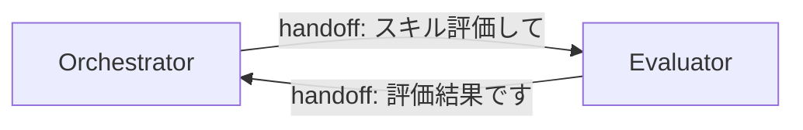
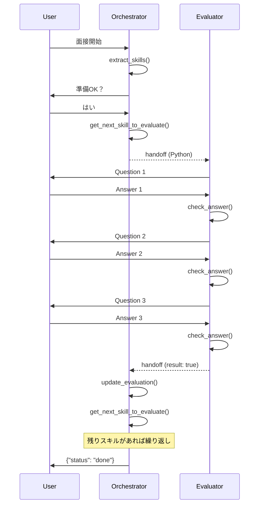

# Lab 16 Walkthrough: Handoffs

この Walkthrough では、Lab 16 の各指示に対して**どのコードが回答になるか**を、Python 文法の解説も含めて詳しく説明します。

---

## Lab 16 の目標

これまで個別に作成した 2 つのエージェントを **handoff** で連携させます。

| エージェント           | 役割                                 |
| ---------------------- | ------------------------------------ |
| Orchestrator Agent     | 面接全体を管理、スキル抽出、結果保存 |
| Skills Evaluator Agent | 各スキルについて 3 問質問して評価    |

**handoff とは？**

Agent A が処理の途中で「この部分は Agent B に任せる」と委譲すること。
完了後、Agent B は「結果を持って Agent A に戻る」ことができる。



---

## Step 1: 不要なコードを削除

### Lab の指示

> - Delete the tool `transfer_to_skill_evaluator`
> - Delete the function `run_orchestrator_agent`
> - Delete the function `run_evaluation_agent`

### なぜ削除するのか？

**Before (Lab 15):**

```python
# 手動でスキル評価を呼び出していた
def transfer_to_skill_evaluator(session_id, skill):
    result = True  # ダミーの結果
    return result
```

**After (Lab 16):**

```python
# handoff で自動的に Evaluator Agent に委譲される
orchestrator_agent.handoffs = [evaluation_agent]
```

handoff 機能を使えば、Agent が自動的に別の Agent を呼び出すため、手動の橋渡しコードは不要になる。

---

## Step 2: `get_next_skill_to_evaluate` を実装

### Lab の指示

> Implement a new tool `get_next_skill_to_evaluate(session_id: str) -> str | None`

### 実装コード

```python
from typing import Optional

@function_tool
def get_next_skill_to_evaluate(session_id: str) -> Optional[str]:
    """Retrieve the next skill to evaluate. Returns None if there are no more skills"""
    if session_id not in interview_state:
        return None

    all_skills = interview_state[session_id]["skills"]
    evaluated = interview_state[session_id]["evaluation"]
    evaluated_skills = [item[0] for item in evaluated]
    remaining_skills = set(all_skills) - set(evaluated_skills)

    try:
        next_skill = remaining_skills.pop()
        print(f"NEXT SKILL: {next_skill}")
        return next_skill
    except KeyError:
        print("No more skills")
        return None
```

### Python 文法解説

#### `str | None` と `Optional[str]`

```python
# Python 3.10+ では
def func() -> str | None:

# Python 3.9 では typing を使う
from typing import Optional
def func() -> Optional[str]:  # これは str | None と同じ意味
```

`Optional[str]` は「文字列を返すか、None を返す」という意味。

#### リスト内包表記 `[item[0] for item in evaluated]`

```python
evaluated = [("Python", True), ("SQL", False)]

# 普通の for ループで書くと
evaluated_skills = []
for item in evaluated:
    evaluated_skills.append(item[0])
# → ["Python", "SQL"]

# リスト内包表記で書くと（1行で同じこと）
evaluated_skills = [item[0] for item in evaluated]
# → ["Python", "SQL"]
```

#### `set()` と差分演算

```python
all_skills = ["Python", "SQL", "AWS"]
evaluated_skills = ["Python"]

# set に変換して差分を取る
remaining_skills = set(all_skills) - set(evaluated_skills)
# → {"SQL", "AWS"}
```

`set` は重複を許さないコレクション。`-` 演算子で差分が取れる。

#### `set.pop()` と `KeyError`

```python
remaining_skills = {"SQL", "AWS"}
next_skill = remaining_skills.pop()  # ランダムに1つ取り出す
# → "SQL" または "AWS"

# 空の set で pop すると KeyError
empty_set = set()
empty_set.pop()  # KeyError!
```

`try/except` で KeyError をキャッチして、空の場合は `None` を返す。

---

## Step 3: `RECOMMENDED_PROMPT_PREFIX` をインポート

### Lab の指示

> Import `from agents.extensions.handoff_prompt import RECOMMENDED_PROMPT_PREFIX`

### 実装コード

```python
from agents.extensions.handoff_prompt import RECOMMENDED_PROMPT_PREFIX
```

### なぜ必要？

**マルチエージェントシステムでは、Agent が:**

1. 自分が何者か理解する
2. 他の Agent の存在を知る
3. いつ handoff すべきか判断する

この指示を毎回書くのは大変なので、OpenAI が推奨するテンプレートが用意されている。

---

## Step 4: プロンプトを更新

### Lab の指示

> Update both agent system prompts with `{RECOMMENDED_PROMPT_PREFIX}` at the top

### Orchestrator プロンプト

```python
ORCHESTRATOR_SYSTEM_PROMPT = """
{RECOMMENDED_PROMPT_PREFIX}

You are an interview orchestrator...

# INSTRUCTIONS
1. Extract key skills using extract_skills tool
2. Welcome candidate and ask if ready
3. Use get_next_skill_to_evaluate to get skill
4. If skill is not None, hand off to "Skills Evaluator Agent"
5. Use update_evaluation to save result
6. When get_next_skill_to_evaluate returns None, return {"status": "done"}
"""
```

### Python 文法解説: f-string vs `.format()`

```python
# f-string（変数を直接埋め込む）
name = "Alice"
f"Hello {name}!"  # → "Hello Alice!"

# .format()（プレースホルダーに後から値を入れる）
"Hello {name}!".format(name="Alice")  # → "Hello Alice!"
```

**なぜ `.format()` を使うのか？**

プロンプトは**定数として定義**したいから。f-string は定義時に変数が必要だが、`.format()` なら後から値を入れられる。

```python
# 定義時（RECOMMENDED_PROMPT_PREFIX はまだ不要）
ORCHESTRATOR_SYSTEM_PROMPT = """
{RECOMMENDED_PROMPT_PREFIX}
...
"""

# 使用時（ここで初めて値を埋め込む）
agent = Agent(
    instructions=ORCHESTRATOR_SYSTEM_PROMPT.format(
        RECOMMENDED_PROMPT_PREFIX=RECOMMENDED_PROMPT_PREFIX
    )
)
```

---

## Step 5: `run()` 関数を実装

### Lab の指示

> Create the main function `def run(session_id, job_id):`

### 実装コード

```python
def run(session_id: str, job_id: int):
    """Run the multi-agent interview system with handoffs"""

    # 1. セッション作成
    session = SQLiteSession(f"screening-{session_id}")

    # 2. Orchestrator Agent 作成
    orchestrator_agent = Agent(
        name="Interview Orchestrator Agent",
        instructions=ORCHESTRATOR_SYSTEM_PROMPT.format(
            RECOMMENDED_PROMPT_PREFIX=RECOMMENDED_PROMPT_PREFIX
        ),
        model="gpt-4.1",
        tools=[extract_skills, get_next_skill_to_evaluate, update_evaluation]
    )

    # 3. Evaluation Agent 作成
    evaluation_agent = Agent(
        name="Skills Evaluator Agent",
        instructions=EVALUATION_SYSTEM_PROMPT.format(
            RECOMMENDED_PROMPT_PREFIX=RECOMMENDED_PROMPT_PREFIX
        ),
        model="gpt-4.1",
        tools=[get_question, check_answer]
    )

    # 4. Handoff 設定 (双方向)
    orchestrator_agent.handoffs = [evaluation_agent]
    evaluation_agent.handoffs = [orchestrator_agent]

    # 5. 実行ループ
    user_input = ORCHESTRATOR_USER_PROMPT.format(job_id=job_id, session_id=session_id)
    agent = orchestrator_agent

    while user_input != 'bye':
        result = Runner.run_sync(agent, user_input, session=session, max_turns=20)
        agent = result.last_agent  # handoff 後のエージェントを追跡
        print(result.final_output)
        user_input = input("User: ")
```

### Handoff 設定の解説

```python
# Orchestrator は Evaluator に handoff できる
orchestrator_agent.handoffs = [evaluation_agent]

# Evaluator は Orchestrator に handoff できる
evaluation_agent.handoffs = [orchestrator_agent]
```

**リストで指定する理由:**
複数の Agent に handoff できるようにするため。例えば:

```python
# 複数の専門家に委譲できる設定
orchestrator.handoffs = [python_evaluator, sql_evaluator, aws_evaluator]
```

### 実行ループの解説

```python
agent = orchestrator_agent  # 最初は Orchestrator から開始

while user_input != 'bye':
    result = Runner.run_sync(agent, user_input, session=session, max_turns=20)

    # handoff が発生したら、last_agent が変わる
    agent = result.last_agent

    # 例:
    # 1回目: agent = Orchestrator → handoff → last_agent = Evaluator
    # 2回目: agent = Evaluator → handoff → last_agent = Orchestrator
```

**`max_turns=20` とは？**

Agent が無限ループに陥らないための制限。20 回のやり取りで強制終了。

### `result.last_agent` の重要性

```python
# handoff が発生すると、最後に実行された Agent が変わる
result = Runner.run_sync(orchestrator_agent, ...)

if result.last_agent == orchestrator_agent:
    print("Orchestrator が最後まで処理した")
elif result.last_agent == evaluation_agent:
    print("Evaluator に handoff して、そこで止まった")
```

次のループでは `last_agent` から継続するため、handoff の連鎖が可能になる。

---

## Step 6: `main()` を更新

### Lab の指示

> Update `main()` to call `run()`

### 実装コード

```python
def main():
    set_default_openai_key(settings.OPENAI_API_KEY)

    job_id = 1
    session_id = "session123"

    print("=" * 60)
    print("Multi-Agent Interview System (Lab 16 - Handoffs)")
    print("=" * 60)

    run(session_id, job_id)

    print("\n" + "=" * 60)
    print(f"FINAL EVALUATION STATE: {interview_state}")
    print("=" * 60)
```

---

## 全体の流れ



---

## テスト結果

```
TestGetNextSkillToEvaluate: 3 passed ✅
TestHandoffImports: 2 passed ✅
```

---

## まとめ

| Lab 指示                     | 対応コード             | Python ポイント                    |
| ---------------------------- | ---------------------- | ---------------------------------- |
| 削除                         | 3 関数を削除           | handoff で不要に                   |
| `get_next_skill_to_evaluate` | set 演算で残りを計算   | `set()`, `pop()`, `Optional`       |
| `RECOMMENDED_PROMPT_PREFIX`  | import 追加            | マルチエージェント用プロンプト     |
| プロンプト更新               | `.format()` で埋め込み | f-string vs `.format()`            |
| `run()`                      | 双方向 handoff 設定    | `handoffs = [agent]`, `last_agent` |
